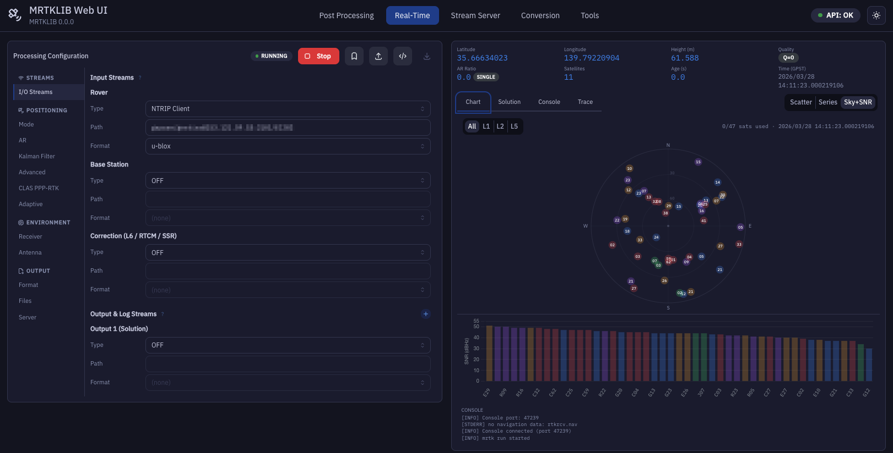

# MRTKLIB Web UI

A modern web-based user interface for [MRTKLIB](https://github.com/h-shiono/MRTKLIB),
running entirely in a Docker container. MRTKLIB is a modernized C11
implementation of RTKLIB with MADOCA-PPP, CLAS PPP-RTK, and advanced
GNSS positioning capabilities. No compilation required — just
`docker compose up` and start processing GNSS data from your browser.


> **Status**: v0.1.0-alpha — core features are functional.
> Known limitations are listed in [Known Issues](#known-issues).



## Features

### Post Processing (`mrtk post`)
- Sidebar navigation covering all MRTKLIB configuration options
  (Positioning, AR, Kalman Filter, Adaptive Filter, CLAS PPP-RTK,
  Environment, Output, Files, Server)
- Full TOML configuration import / export
- Named preset management (saved to `/workspace/presets/`)
- Support for all positioning modes: Single, DGPS, Kinematic,
  Static, PPP-Kinematic, PPP-Static, PPP-AR, CLAS PPP-RTK,
  MADOCA PPP, VRS-RTK

### Real-Time Positioning (`mrtk run`)
- Live position display (Lat / Lon / Height / AR Ratio /
  Satellites / Age / GPST)
- Fix quality badges: FIXED / FLOAT / SINGLE color-coded
- Position scatter plot (E/N, 1:1 aspect ratio, quality colors)
- Time series chart
- Sky plot + SNR bar chart (per-constellation color coding,
  used/unused satellite highlighting)
- Solution and trace output streaming

### Stream Relay (`mrtk relay`)
- Multi-stream configuration (up to 4 simultaneous streams)
- Per-stream Start / Stop control with live console output

### RINEX Conversion (`mrtk convert`)
- Supports all convbin formats: u-blox, Septentrio SBF,
  NovAtel, BINEX, Trimble RT17, RTCM2/3, RINEX re-processing
- Collapsible option groups (Time Range, Signal Options,
  RINEX Header, Debug)
- Live command preview before execution
- RINEX file preview after conversion (header + first 5–10 epochs)

### Receiver Monitor (NMEA / UBX / SBF)
- Direct connection to GNSS receiver without invoking `mrtk run`
- Parses NMEA GGA/RMC, UBX NAV-PVT, SBF PVTGeodetic
- Live position visualization identical to Real-Time tab
- Raw data file logging to `/workspace/logs/`

### Tools
- **GNSS Time Converter**: fully bidirectional conversion between
  Calendar/UTC, GPS Week/ToW, and Day of Year/Session
- **Data Downloader**: QZSS L6D (CLAS) and L6E (MADOCA) file
  download; IGS atx update; IGS products and GSI CORS data
  (NASA Earthdata and GSI credentials required for the latter two)

### Configuration & Workflow
- Two-volume Docker setup: `/workspace` (read-write) and
  `/data` (read-only host data directory)
- Server-side preset management with import / export
- TOML import with lossless round-trip (unknown keys preserved)
- IBM Plex Sans + IBM Plex Mono typography
- Dark / light mode toggle

---

## Getting Started

### Prerequisites

- Docker and Docker Compose
- GNSS data files (RINEX observation and navigation files)

### Quick Start

1. **Clone the repository**
   ```bash
   git clone https://github.com/h-shiono/mrtklib-docker-ui.git
   cd mrtklib-docker-ui
   ```

2. **Configure directories**
   ```bash
   mkdir -p ./workspace ./data
   cp .env.example .env
   # Edit .env to set DATA_DIR to your GNSS data directory
   ```

3. **Build and run**
   ```bash
   docker compose up --build
   ```

4. **Open the UI**
   ```
   http://localhost:8080
   ```

### Data Directory Configuration

| Mount | Default | Purpose | Access |
|-------|---------|---------|--------|
| `/workspace` | `./workspace` | Output files, presets, logs | Read-write |
| `/data` | `./data` | Input GNSS data files | Read-only |
```bash
# .env
DATA_DIR=/path/to/your/gnss-data
```

### Serial Device Passthrough (Monitor tab)

To connect to a GNSS receiver via serial port, add the device
to `docker-compose.yml`:
```yaml
services:
  app:
    devices:
      - /dev/ttyUSB0:/dev/ttyUSB0
```

### Credentials (Data Downloader)

The Data Downloader supports three credential sources
(priority order: `.netrc` mount > environment variables > UI):
```bash
# .env
EARTHDATA_USER=your_username    # NASA Earthdata (IGS products)
EARTHDATA_PASSWORD=your_password
GSI_USER=your_username          # GSI CORS FTP
GSI_PASSWORD=your_password
```

QZSS L6D/L6E files require no authentication.

---

## Architecture

### Technology Stack

#### Backend
- **Language**: Python 3.11+
- **Framework**: FastAPI
- **Process Management**: asyncio.subprocess
- **Real-time Communication**: WebSocket
- **Data Validation**: Pydantic v2

#### Frontend
- **Framework**: React 18 + TypeScript
- **Build Tool**: Vite
- **UI Library**: Mantine v7
- **Charts**: Chart.js, uPlot, Recharts
- **Typography**: IBM Plex Sans + IBM Plex Mono

#### Deployment
- **Container**: Multi-stage Docker build
- **MRTKLIB Binary**: Built from source via CMake (`mrtk` unified binary)
- **Volumes**: `/workspace` (read-write), `/data` (read-only)

---

## Development Setup

### Backend
```bash
uv sync
uv run uvicorn mrtklib_web_ui.main:app --reload --host 0.0.0.0 --port 8000
```

### Frontend
```bash
cd frontend
npm install
npm run dev   # http://localhost:5173
```

The frontend dev server runs on `http://localhost:5173` and proxies
API requests to the backend at `http://localhost:8000`.

---

## Roadmap

| Version | Description |
|---------|-------------|
| **v0.1.0-alpha** (current) | Core UI for all `mrtk` subcommands, presets, TOML I/O, Monitor tab |
| **v0.2.0** | Configuration reference full verification, template presets, coordinate converter, Monitor Sky+SNR |
| **v0.3.0** | IGS/GSI downloader (auth), GitHub Container Registry publish |

---

## Known Issues

This is an alpha release. Many features have been implemented
but not yet thoroughly tested in real-world conditions.
Bug reports and feedback are very welcome — please
[open an issue](https://github.com/h-shiono/mrtklib-docker-ui/issues).

### Known untested or partially tested areas

- **Real-Time positioning** (`mrtk run`): basic operation confirmed;
  edge cases (stream reconnection, dual-channel CLAS, long runs)
  not yet validated
- **Monitor tab** (NMEA/UBX/SBF): parser logic implemented but
  not tested against real receiver hardware
- **Data Downloader**: QZSS L6D/L6E endpoints implemented;
  IGS products (NASA Earthdata) and GSI CORS (FTP) untested
- **TOML import round-trip**: basic cases work; complex configs
  with all options may have edge cases
- **Configuration option coverage**: UI covers all options from
  the reference, but default values and conditional logic have
  not been exhaustively verified
- **RINEX preview**: implemented but not tested across all
  receiver formats
- **Monitor tab Sky+SNR**: not yet implemented (planned for v0.2.0)
- **Coordinate converter**: not yet implemented (planned for v0.2.0)
- **Template presets**: not yet implemented (planned for v0.2.0)

### Platform notes

- Tested on: Linux (Ubuntu 22.04), macOS (Apple Silicon)
- Windows (Docker Desktop): untested

All bug reports are appreciated, including partial or unclear ones.

---

## Contributing

Contributions of all kinds are welcome — bug reports, feature
requests, documentation improvements, and pull requests.

**The most helpful thing right now is real-world testing.**
If you try MRTKLIB Web UI with your own receiver or dataset
and something does not work as expected, please open an issue.
You do not need to have a fix ready — a clear description of
what happened is enough.

### Opening an Issue

When reporting a bug, please include:

- Which tab / feature was affected
- What you expected to happen
- What actually happened
- Browser and OS (and Docker version if relevant)
- Any error messages from the browser console or Docker logs

For feature requests, a brief description of the use case
is more useful than a specific implementation proposal.

### Pull Requests

For small fixes (typos, obvious bugs), a PR is welcome directly.
For larger changes, please open an issue first to discuss
the approach — this avoids duplicated effort.

### Guidelines

- Python: PEP 8, type hints throughout
- TypeScript: strict mode, functional components
- Commits: conventional commits (`feat:`, `fix:`, `docs:`)
- Do not modify MRTKLIB source code in this repository

---

## License

MIT License. See [LICENSE](LICENSE).

MRTKLIB is distributed under the BSD 2-Clause License.
This project provides a web interface only and does not modify
MRTKLIB source code.

---

## Acknowledgements

Built on [MRTKLIB](https://github.com/h-shiono/MRTKLIB) by Hayato Shiono,
which is a modernized fork of
[RTKLIB](https://github.com/tomojitakasu/RTKLIB) by Tomoji Takasu.

Developed with assistance from **Claude** (Anthropic) and
**Gemini** (Google).

Key dependencies: FastAPI · React · Mantine · Vite · Chart.js · uv